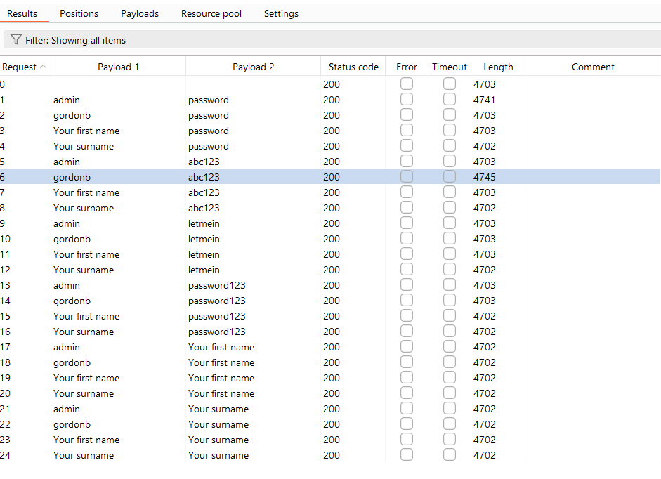

# **Week 4**

### Grading

Task #|Points|Description|
-----|:---:|----------|
Task 1 | 1 | Side-channels
Task 2 | 1 | Slow Loris
Task 3 | 2 | BurpSuite & thc-hydra

---

# Tasks

### Task 1: Side-channels

## Example attack (currently imaginary as far as I know)
This could be a fun experiment to do, is this even remotely possible. Might be something I read somewhere that this
kind of technique is already developed as this sounds so familiar when I am now thinking about this. However I could not
find the article for further investigation.
The attack:
Keyboard keys give a slightly different sound depending where the key is located in the keyboard. They are probably designed 
in uniform manner but the point of location gives a slightly different sound when the key is pressed. The same happens 
if you tap a wooden table in different locations. Human ear is probably not good enough to tell difference except 
other than the real unique sounds on the keyboard, like the space or enter strokes, but AI when trained might be able. 
The attack would simply be a microphone placed in a room listening to keystrokes. The training would be done with the 
target keyboard and with the correct distance and angle of the keyboard to the microphone.
If the tool would be able to record the text typed in with the keyboard, it could capture passwords and other sensitive
information typed in with just a careful placement of a microphone in a room. Maybe just a smartphone left in the room.
People are used to protect the view to the keyboard when typing sensitive information e.g typing in password when there are 
people behind you or typing in ATM code, but they probably do not expect that someone is listening to the keystrokes.

Choose an example of a side-channel attack and explain the following information about it:

- Brief explanation of what side-channel the attack uses and how
    - the sounds of the keyboard keys, when they are recorded and analyzed with the help of AI

- What systems does it affect?
    - Any system where information is feeded through keyboard interface or similar.

- What information is leaked via the side channel?
    - possibly all the typed information.

- Is there a documented case of it being used in a real life attack?
    - Not to my knowledge

- Has it been fixed? If yes, how it was fixed?
    - There are some distinguishable differences with the keyboard key sounds and they are probably not fixed any time soon.

This time, You are not expected to produce an essay. Direct answers to questions above are sufficient. List sources and keep the answer concise at max 300 words not including sources.

---

### Task 2: Slow Loris

**HOX! Consider Slow Loris as a type of attack rather than the 'slowloris' program itself**

Seek information about the Slowloris Denial-of-Service attack and answer to the following questions:

- How does it work?
    - The attacker will open many connections to the server, but unlike the regular DOS attack the aim is to keep each connection
    alive as long as possible. Let's imagine that the timeout happens after 1 minute of each connection. The frames of the request
    are send so slowly that each request will hold the connection open for that minute. Because each connection lasts a minute
    instead of milliseconds fewer connections are needed and less frames needs to be sent to block the service.

- Why is it unique while compared to the other high bandwith DDoS attacks?
    - the attacker does not have to have a high end equipment and connection to flood and block the server.

- What are the effects of the attack?
    - Regular users are unable to use the service.

- How can you mitigate/prevent the effects of the attack?
    - Cloudflare uses buffering incoming request so that this kind of attack do not effect them.

- Are there any notable instances of this style of attack being performed?
    - Iran has accused US in 2009 for this kind of attack against their government websites. And 2011 hackers
    performed this attack to CIA.

This time, You are not expected to produce an essay. Direct answers to questions above are sufficient. List sources and keep the answer concise at max 300 words not including sources

---

### **Task 3**: BurpSuite Introduction

## **Subtask 1**: Intercepting (0.25p)

To your github return repository, add a screenshot/screenshots of your edited post so that all the following information is visible.  

-**Listing of the last POST and GET request including timestamps and port**  
-**Entire Edited POST request in Raw format**  

## **Subtask 2**: Repeater (0.25p)

The session id is created from timestamp and it increases by one with every second (as it is a timestamp).

## **Subtask 3**: Intruder (0.25p)

All the attempts return 200 ok, so there is no differences, between the attempts, but the length is different with two attempts,
- gordonb - abc123
- admin - password

The length is greater in these when compared to the majority of lenghts (4702 and 4703). There is also a "welcome to password protected
area" text in the response. I also tested these passwords in the ui and the same text becomes visible there too with a small photo of the user.
 

## **Subtask 4**: Decoder (0.25p)

Encoding to URL

Encoding to HTML

Decoding URL

Decoding HTML

## **Subtask 5**: thc-hydra (1p)
I changed the password to "baaa" to keep the time it takes to brute force it a bit smaller, compared to e.g bzzz. I also provided the command that we are looking
for exactly a 4 character word to trim down the brute force time.

The command:

docker run --network="host" vanhauser/hydra -V -f -I -l admin -x 4:4:a "http-get-form://localhost/vulnerabilities/brute/:username=^USER^&password=^PASS^&Login=Login:H=Cookie:PHPSESSID=1oam1fog6j13g9gmh85gqo8qj5; security=low:F=Username and/or password incorrect."

started     10:50:55

finished    10:54:44

~ 4 minutes

